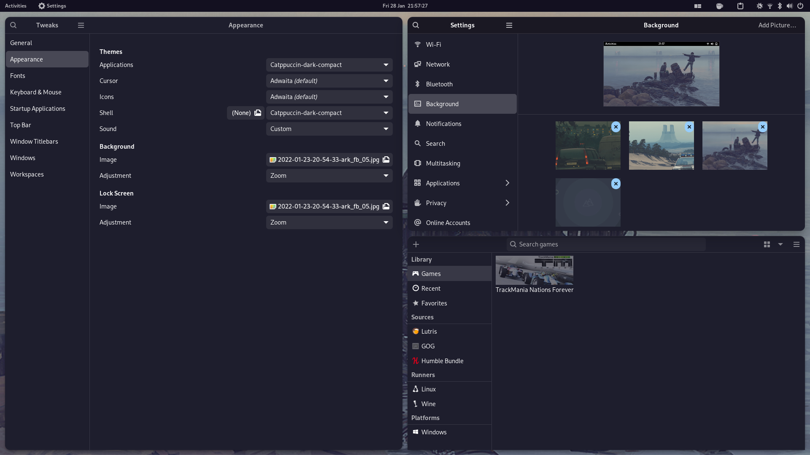
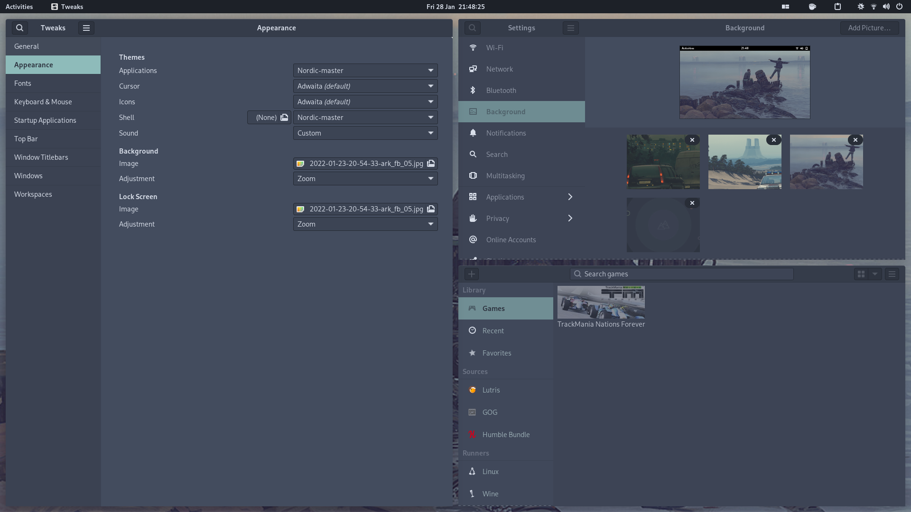
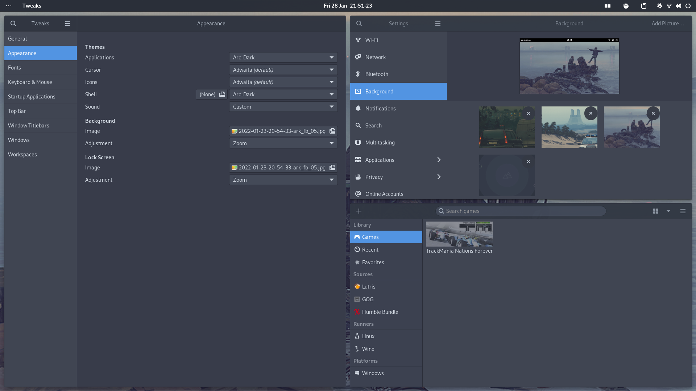
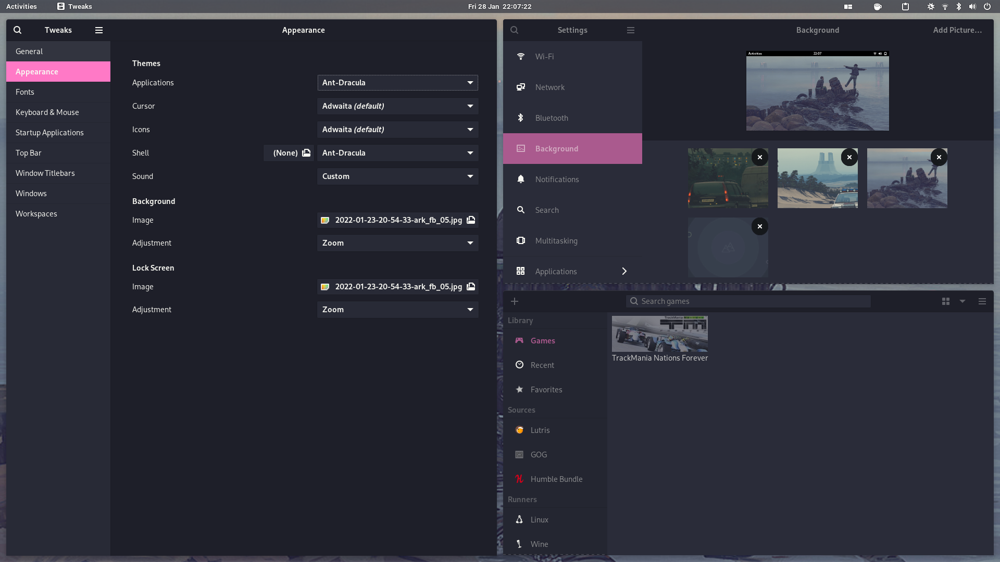
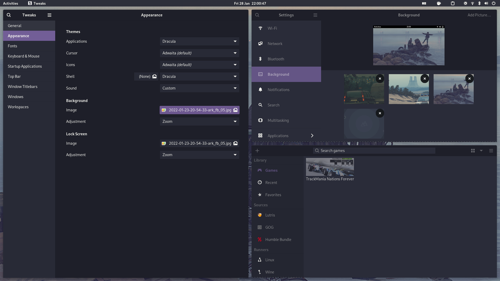
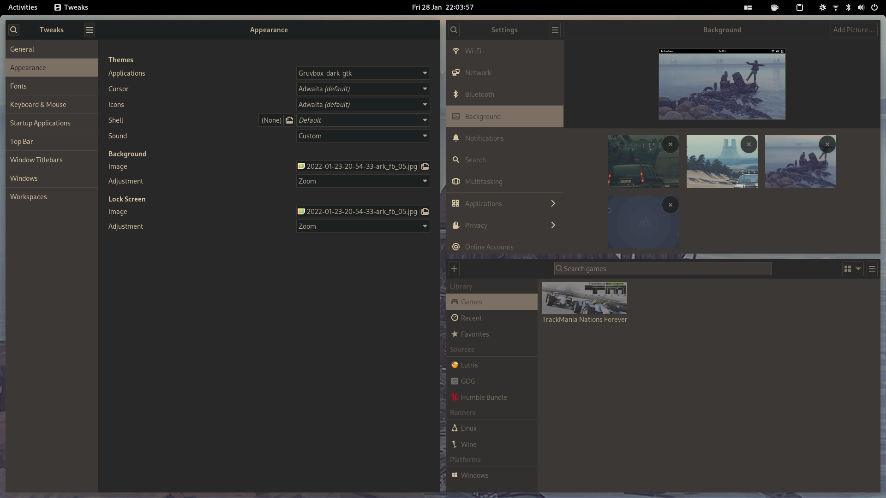
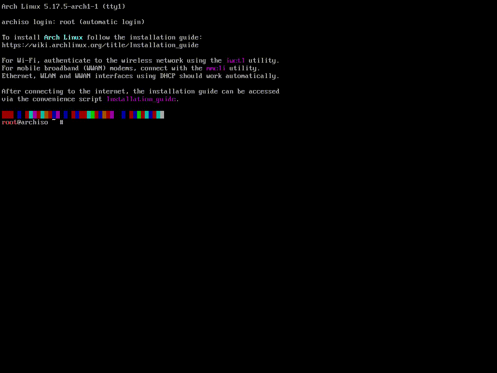

# dofe-arch-install
## Description
This is a script that is written for my [DofE](https://www.dofe.org/) skills (coding). There are two scripts, one for pre-install (to install) and one for post-install (to configure).

In both scripts options will be presented to the user. In the install script these options are: 
* Username
* password
* root password
* hostname

In the configuration script the user will be asked which themes they want to install and which theme they want enabled by default.

The distro that will be installed is [arch linux](https://archlinux.org/) and it is a very minimalistic and customizable distribution of linux which is why I have chosen it for this project.

### Themes
<p align="center">These are the themes available:</p> 
<p align="center">Catppuccin:</p>
<p align="center">


</p>


<p align="center">Nordic:</p>
<p align="center">


</p>


<p align="center">Arc-dark:</p>
<p align="center">


</p>


<p align="center"Ant-dracula:</p>
<p align="center">


</p>


<p align="center">Dracula:</p>
<p align="center"


</p>


<p align="center">Gruvbox-dark</p>
<p align="center">


</p>

## Warnings
* This is only built to work on a live arch linux USB (in a virtual machine or bare metal)
* This means you should **NOT** attempt to use it on windows or mac-os
## Setting up and executing the scripts
#### This in the live usb
```bash
sudo pacman -Syu git 
git clone https://github.com/max12mx13/dofe-arch-install.git
cd dofe-arch-install
chmod +x pre-install.sh 
./pre-install.sh
```
#### This once installed
```bash
cd Documents
./post-install.sh
```

## TODO
### Git
- [x] Create nice README.md (what you are reading now)
### Install script
- [x] First bits of the install script (Disks and installing base)
- [x] Finishing install script (other stuff in a chroot)
- [x] Documenting and debugging code
- [ ] Testing in a vm and recording
### Theming
- [ ] Create TUI for theming options
- [ ] Make themes arc,nordic and dracula accessible
- [ ] Make themes catppuccin, ant and gruvbox accessible
- [ ] Documenting and debugging code
### Final configuration
- [ ] Stow'ing config
- [ ] Final testing in vm and recording

## Films of tests
### Install in vm


## Credits
[Ant](https://github.com/EliverLara/Ant)

[Nordic](https://github.com/EliverLara/Nordic)

[Gruvbox](https://github.com/jmattheis/gruvbox-dark-gtk)

[Dracula](https://github.com/dracula/gtk)

[Arc](https://github.com/horst3180/arc-theme)

[Catppuccin](https://github.com/catppuccin/gtk)
